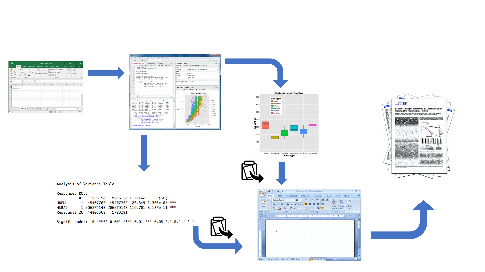
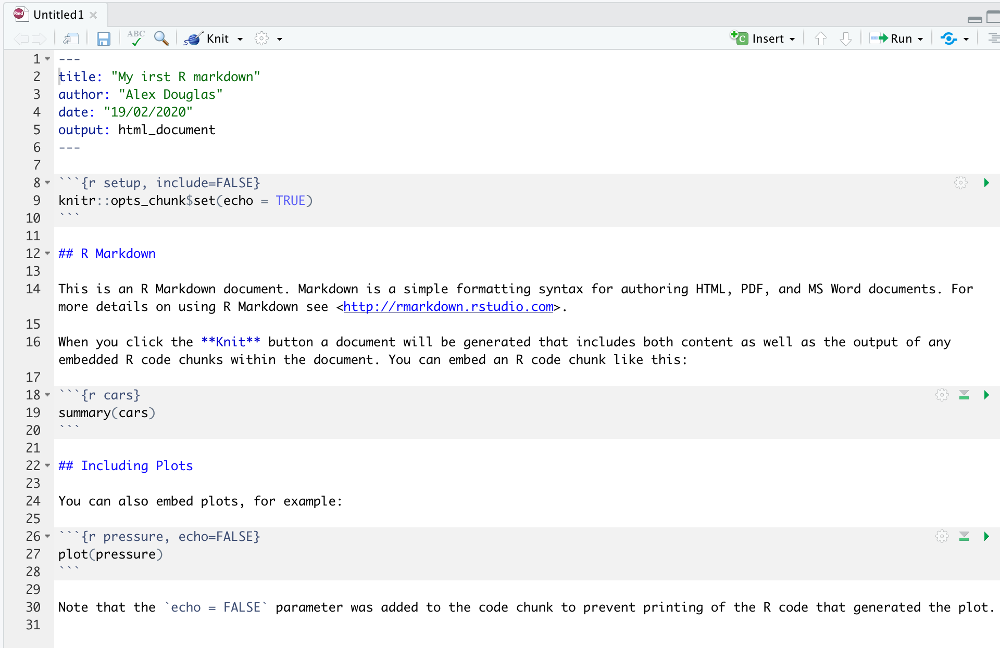
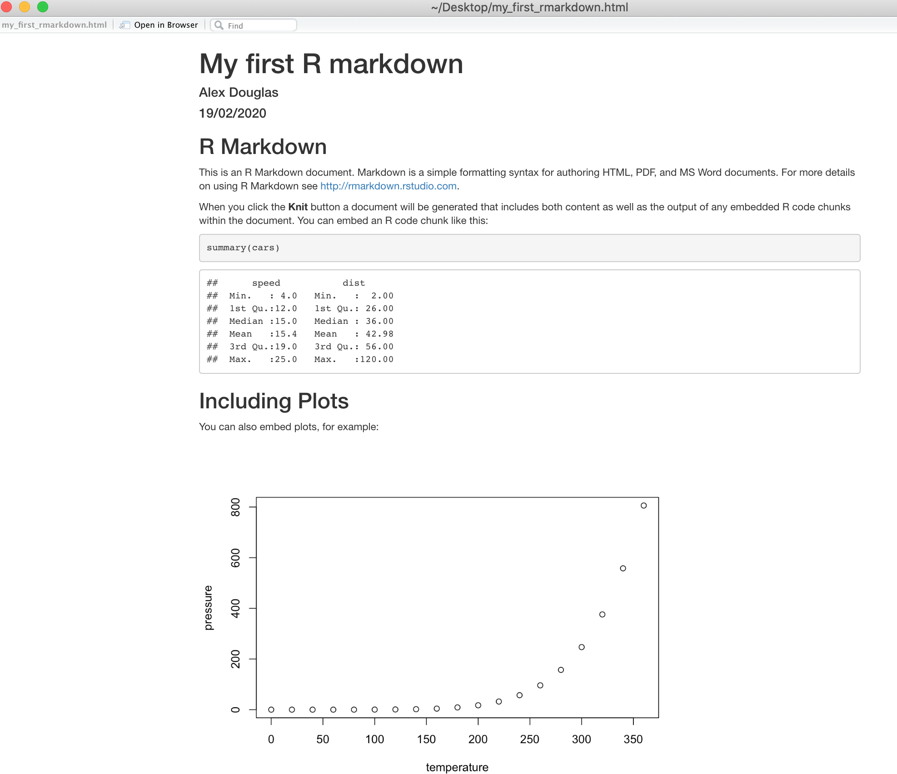

# Reproducible reports with R markdown {#rmarkdown_r}

```{r, include=FALSE}
library(knitr)
suppressPackageStartupMessages(library(knitr))
```

This chapter will introduce you to creating reproducible reports using R markdown to encourage best (or better) practice to facilitate open science. It will first describe what R markdown is and why you might want to consider using it, describe how to create an R markdown document using RStudio and then how to convert this document to a html or pdf formatted report. During this Chapter you will learn about the different components of an R markdown document, how to format text, graphics and tables within the document and finally how to avoid some of the common difficulties using R markdown.

## What is R markdown?

R markdown is a simple and easy to use plain text language used to combine your R code, results from your data analysis (including plots and tables) and written commentary into a single nicely formatted and reproducible document (like a report, publication, thesis chapter or a web page like this one).  

Technically, R markdown is a variant of another language (yet another language!) called Markdown and both are a type of 'markup' language. A markup language simply provides a way of creating an easy to read plain text file which can incorporate formatted text, images, headers and links to other documents. Don't worry about the details for the moment, although if you're interested you can find more information about markup languages [here][markup]. Actually, if it makes you feel any better all of you will have been exposed to a markup language before, as most of the internet content you digest every day is underpinned by a markup language called HTML (**H**yper**t**ext **M**arkup **L**anguage). Anyway, the main point is that R markdown is very easy to learn (much, much easier than HTML) and when used with RStudio it's ridiculously easy to integrate into your workflow to produce feature rich content (so why wouldn't you?!). 

## Why use R markdown?

During the previous Chapters we talked a lot about conducting your research in a robust and reproducible manner to facilitate open science. In a nutshell, open science is about doing all we can to make our data, methods, results and inferences transparent and available to everyone. Some of the main tenets of open science are described [here][open-sci2] and include:

- Transparency in experimental methodology, observation, collection of data and analytical methods.
- Public availability and re-usability of scientific data
- Public accessibility and transparency of scientific communication
- Using web-based tools to facilitate scientific collaboration

By now all of you will (hopefully) be using R to explore and analyse your interesting data. As such, you're already well along the road to making your analysis more reproducible, transparent and shareable. However, perhaps your current workflow looks something like this:

\  

```{r, echo=FALSE, fig.align='center', out.width='90%'}

```

\  

Your data is imported from your favourite spreadsheet software into RStudio (or R), you write your R code to explore and analyse your data, you save plots as external files, copy tables of analysis output and then manually combine all of this and your written prose into a single MS Word document (maybe a paper or thesis chapter). Whilst there is nothing particularly wrong with this approach (and it's certainly better than using point and click software to analyse your data) there are some limitations:

- It's not particularly reproducible. Because this workflow separates your R code from the final document there are multiple opportunities for undocumented decisions to be made (which plots did you use? what analysis did/didn't you include? etc).    

- It's inefficient. If you need to go back and change something (create a new plot or update your analysis etc) you will need to create or amend multiple documents increasing the risk of mistakes creeping into your workflow.

- It's difficult to maintain. If your analysis changes you again need to update multiple files and documents. 

- It can be difficult to decide what to share with others. Do you share all of your code (initial data exploration, model validation etc) or just the code specific to your final document? It's quite a common (and bad!) practice for researchers to maintain two R scripts, one used for the actual analysis and one to share with the final paper or thesis chapter. This can be both time consuming and confusing and should be avoided.

Perhaps a more efficient and robust workflow would look something like this: 

\  

```{r, echo=FALSE, fig.align='center', out.width='90%'}
include_graphics("images/workflow2.png")
```

\ 

Your data is imported into RStudio (or R) as before but this time all of the R code you used to analyse your data, produce your plots and your written text (Introduction, Materials and Methods, Discussion etc) is contained within a single R markdown document which is then used (along with your data) to automatically create your final document. This is exactly what R markdown allows you to do.

Some of the advantages of using R markdown include: 

- Explicitly links your data with your R code and output creating a fully reproducible workflow. **ALL** of the R code used to explore, summarise and analyse your data can be included in a single easy to read document. You can decide what to include in your final document (as you will learn below) but all of your R code can be included in the R markdown document. 

- You can create a wide variety of output formats (pdf, html web pages, MS Word and many others) from a single R markdown document which enhances both collaboration and communication.

- Enhances transparency of your research. Your data and R markdown file can be included with your publication or thesis chapter as supplementary material or hosted on a GitHub repository (see the GitHub [Chapter](#github_r)). 

- Increases the efficiency of your workflow. If you need to modify or extend your current analysis you just need to update your R markdown document and these changes will automatically be included in your final document.

## Get started with R markdown

To use R markdown you will first need to install the ```rmarkdown``` package\index{rmarkdown package} in RStudio (or in the R console if you're not using RStudio) and any package dependencies. You can find instructions on how to do this for both Windows and Mac OSX operating systems [here](#install-rm). If you would like to create pdf documents (or MS Word documents) from your R markdown file you will also need to install a version of LaTeX on your computer. If you've not installed LaTeX before, we recommend that you install [TinyTeX][tinytex]. Again, instructions on how to do this can be found [here](#install-rm). 

## Create an R markdown document {#new_rm}

Right, time to create your first R markdown document. Within RStudio, click on the menu `File` -> `New File` -> `R Markdown...`. In the pop up window, give the document a 'Title' and enter the 'Author' information (your name) and select HTML as the default output. We can change all of this later so don’t worry about it for the moment.

\  

```{r, echo=FALSE, fig.align='center', out.width='85%'}
include_graphics("images/new_rm2.png")
```

\  

You will notice that when your new R markdown document is created it includes some example R markdown code. Normally you would just highlight and delete everything in the document except the information at the top between the `---` delimiters (this is called the YAML header which we will discuss in a bit) and then start writing your own code. However, just for now we will use this document to practice converting R markdown to both html and pdf formats and check everything is working.    

\  

```{r, echo=FALSE, fig.align='center', out.width='85%'}

```

\  

Once you've created your R markdown document it's good practice to save this file somewhere convenient. You can do this by selecting `File` -> `Save` from RStudio menu (or use the keyboard shortcut ctrl + s on Windows or cmd + s on a Mac) and enter an appropriate file name (maybe call it `my_first_rmarkdown`). Notice the file extension of your new R markdown file is `.Rmd`.  

Now, to convert your `.Rmd` file to a HTML document click on the little black triangle next to the `Knit` icon at the top of the source window and select `knit to HTML`  

\  

```{r, echo=FALSE, fig.align='center', out.width='85%'}
include_graphics("images/knit_rm.png")
```

\  

RStudio will now 'knit' (or render) your `.Rmd` file into a HTML file. Notice that there is a new `R Markdown` tab in your console window which provides you with information on the rendering process and will also display any errors if something goes wrong. 

\  

```{r, echo=FALSE, fig.align='center', out.width='85%'}
include_graphics("images/Rmarkdown_console.png")
```

\  

If everything went smoothly a new HTML file will have been created and saved in the same directory as your `.Rmd` file (ours will be called `my_first_rmarkdown.html`). To view this document simply double click on the file to open in a browser (like Chrome or Firefox) to display the rendered content. RStudio will also display a preview of the rendered file in a new window for you to check out (your window might look slightly different if you're using a Windows computer).

\  

```{r, echo=FALSE, fig.align='center', out.width='85%'}

```

\  

Great, you've just rendered your first R markdown document. If you want to knit your `.Rmd` file to a pdf document then all you need to do is choose `knit to PDF` instead of `knit to HTML` when you click on the `knit` icon. This will create a file called `my_first_rmarkdown.pdf` which you can double click to open. Give it a go!

You can also knit an `.Rmd` file using the command line in the console rather than by clicking on the knit icon. To do this, just use the `render()`\index{render()} function from the  `rmarkdown` package as shown below. Again, you can change the output format using the `output_format=` argument as well as many other options.

\  

```{r, class.source='fold-show', echo=TRUE, eval=FALSE}
library(rmarkdown)

render('my_first_rmarkdown.Rmd', output_format = 'html_document')

# alternatively if you don't want to load the rmarkdown package

rmarkdown::render('my_first_rmarkdown.Rmd', output_format = 'html_document')

# see ?render for more options
```

## R markdown anatomy

OK, now that you can render an R markdown file in RStudio into both HTML and pdf formats let's take a closer look at the different components of a typical R markdown document. Normally each R markdown document is composed of 3 main components, 1) a YAML header, 2) formatted text and 3) one or more code chunks.

\  

```{r, echo=FALSE, fig.align='left', out.width='85%'}
include_graphics("images/rm_components.png")
```

\  

### YAML header

YAML stands for '**Y**AML **A**in’t **M**arkup **L**anguage' (it's an 'in' [joke][joke]!) and this optional component contains the metadata and options for the entire document such as the author name, date, output format, etc. The YAML header is surrounded before and after by a `---` on its own line. In RStudio a minimal YAML header is automatically created for you when you create a new R markdown document as we did [above](#new_rm) but you can change this any time. A simple YAML header may look something like this:

```yaml
---
title: My first R markdown document
author: Jane Doe
date: March 01, 2020
output: html_document
---
```

In the YAML header above the output format is set to HTML. If you would like to change the output to pdf format then you can change it from `output: html_document` to  `output: pdf_document` (you can also set more than one output format if you like). You can also change the default font and font size for the whole document and even include fancy options such as a table of contents and inline references and a bibliography. If you want to explore the plethora of other options see [here][bookdownr]. Just a note of caution, many of the options you can specify in the YAML header will work with both HTML and pdf formatted documents, but not all. If you need multiple output formats for your R markdown document check whether your YAML options are compatible between these formats. Also, indentation in the YAML header has a meaning, so be careful when aligning text. For example, if you want to include a table of contents you would modify the `output:` field in the YAML header as follows

```yaml
---
title: My first R markdown document
author: Jane Doe
date: March 01, 2020
output:
  html_document:
    toc: yes
---
```

### Formatted text

As mentioned above, one of the great things about R markdown is that you don't need to rely on your word processor to bring your R code, analysis and writing together. R markdown is able to render (almost) all of the text formatting that you are likely to need such as italics, bold, strike-through, super and subscript as well as bulleted and numbered lists, headers and footers, images, links to other documents or web pages and also equations. However, in contrast to your familiar *What-You-See-Is-What-You-Get* ([WYSIWYG][WYSIWYG]) word processing software you don't see the final formatted text in your R markdown document (as you would in MS Word), rather you need to 'markup' the formatting in your text ready to be rendered in your output document. At first, this might seem like a right pain in the proverbial but it's actually very easy to do and also has many [advantages][markup-adv] (do you find yourself spending more time on making your text look pretty in MS Word rather than writing good content?!).  

Here is an example of marking up text formatting in an R markdown document 

```md
#### Benthic Biodiversity experiment
These data were obtained from a mesocosm experiment which aimed to examine the effect 
of benthic polychaete (*Nereis diversicolor*) biomass on sediment nutrient 
(NH~4~, NO~3~ and PO~3~) release. At the start of the experiment 15 replicate mesocosms 
were filled with 20 cm^2^ of **homogenised** marine sediment and assigned to one of five 
polychaete biomass treatments (0, 0.5, 1, 1.5, 2 g per mesocosm).
```

which would look like this in the final rendered document (can you spot the markups?)

>#### Benthic Biodiversity experiment {.unlisted .unnumbered}

>These data were obtained from a mesocosm experiment which aimed to examine the effect of benthic polychaete (*Nereis diversicolor*) biomass on sediment nutrient (NH~4~, NO~3~ and PO~3~) release. At the start of the experiment replicate mesocosms were filled with 20 cm^2^ of **homogenised** marine sediment and assigned to one of five polychaete biomass treatments (0, 0.5, 1, 1.5, 2 g per mesocosm).

#### Emphasis {-}

Some of the most common R markdown syntax for providing emphasis and formatting text is given below.

\  

|     Goal       |    R markdown       |     output        |
|:--------------:|:-------------------:|:-----------------:|
|  bold text     |   `**mytext**`   |   **mytext**   |
|  italic text   |   `*mytext*`   |   *mytext*   |
|  strikethrough | `~~mytext~~` | ~~mytext~~ |
|  superscript   |   `mytext^2^`  |   mytext^2^  |
|  subscript     |   `mytext~2~`    |   mytext~2~    |

\  

Interestingly there is no underline R markdown syntax by default. We think this is because bold and italics are used to emphasise content (a semantic meaning) whereas an underline is considered a stylistic element (there may well be other [reasons][underline]). If you really want to underline text you can use `<span style="text-decoration:underline">underline this text</span>` for HTML output or `$\text{\underline{This sentence underlined using \LaTeX}}$` for pdf output. We just avoid underlining!

#### White space and line breaks {-}

One of the things that can be confusing for new users of R markdown is the use of spaces and carriage returns (the enter key on your keyboard). In R markdown multiple spaces within the text are generally ignored as are carriage returns. For example this R markdown text

```md
These      data were      obtained from a
mesocosm experiment which    aimed to examine the
effect
of          benthic polychaete (*Nereis diversicolor*) biomass.
```

will be rendered as 

>These      data were      obtained from a
>mesocosm experiment which    aimed to examine the
>effect
>of          benthic polychaete (*Nereis diversicolor*) biomass.


This is generally a good thing (no more random multiple spaces in your text). If you want your text to start on a new line then you can simply add two blank spaces at the end of the preceding line 


>These      data were      obtained from a  
>mesocosm experiment which    aimed to examine the    
>effect          benthic polychaete (*Nereis diversicolor*) biomass.     


If you really want multiple spaces within your text then you can use the **N**on **b**reaking **sp**ace tag `&nbsp;`

```{r, class.source='fold-show', eval=FALSE, highlight=FALSE, tidy=FALSE}
These &nbsp; &nbsp; &nbsp; data were &nbsp; &nbsp; &nbsp; &nbsp; obtained from a  
mesocosm experiment which &nbsp; &nbsp; aimed to examine the    
effect &nbsp; &nbsp; &nbsp; &nbsp; benthic polychaete (*Nereis diversicolor*) biomass.
```
 

>These &nbsp; &nbsp; &nbsp; data were &nbsp; &nbsp; &nbsp; &nbsp; obtained from a  
>mesocosm experiment which &nbsp; &nbsp; aimed to examine the    
>effect &nbsp; &nbsp; &nbsp; &nbsp; benthic polychaete (*Nereis diversicolor*) biomass.

#### Headings {-}

You can add headings and subheadings to your R markdown document by using the `#` symbol at the beginning of the line. You can decrease the size of the headings by simply adding more `#` symbols. For example 

```md
# Benthic Biodiversity experiment
## Benthic Biodiversity experiment
### Benthic Biodiversity experiment
#### Benthic Biodiversity experiment
##### Benthic Biodiversity experiment
###### Benthic Biodiversity experiment
```

results in headings in decreasing size order

```{asis, echo=TRUE, eval=knitr::is_html_output()}
># Benthic Biodiversity experiment {.unlisted .unnumbered}
>## Benthic Biodiversity experiment {.unlisted .unnumbered}
>### Benthic Biodiversity experiment {.unlisted .unnumbered}
>#### Benthic Biodiversity experiment {.unlisted .unnumbered}
>##### Benthic Biodiversity experiment {.unlisted .unnumbered}
>###### Benthic Biodiversity experiment {.unlisted .unnumbered}
```

#### Comments {-}

As you can see above the meaning of the `#` symbol is different when formatting text in an R markdown document compared to a standard R script (which is used to included a comment - remember?!). You can, however, use a `#` symbol to comment code inside a [code chunk](#code_chunks) as usual (more about this in a bit). If you want to include a comment in your R markdown document outside a code chunk which won't be included in the final rendered document then enclose your comment between `<!--` and `-->`.

```md
<!--
this is an example of how to format a comment using R markdown.
-->
```

#### Lists {-}

If you want to create a bullet point list of text you can format an unordered list with sub items. Notice that the sub-items need to be indented.  

```markdown
- item 1
- item 2
   + sub-item 2
   + sub-item 3
- item 3
- item 4
```

\  

>- item 1
>- item 2
>   + sub-item 2
>   + sub-item 3
>- item 3
>- item 4

\  

If you need an ordered list 

```md

1. item 1
2. item 2
     + sub-item 2
     + sub-item 3
3. item 3
4. item 4
```

\  

>1. item 1
>2. item 2
>     + sub-item 2
>     + sub-item 3
>3. item 3
>4. item 4

#### Images {-}

Another useful feature is the ability to embed images and links to web pages (or other documents) into your R markdown document. You can include images into your R markdown document in a number of different ways. Perhaps the simplest method is to use

```markdown

```

resulting in:


The code above will only work if the image file (`Cute_grey_kitten.jpg`) is in the right place relative to where you saved your `.Rmd` file. In the example above the image file is in a sub directory (folder) called `images` in the directory where we saved our `my_first_rmarkdown.Rmd` file. You can embed images saved in many different file types but perhaps the most common are `.jpg` and `.png`. 

We think a more flexible way of including images in your document is to use the `include_graphics()`\index{include\_graphics()} function from the `knitr`\index{knitr package} package as this gives finer control over the alignment and image size (it also works more or less the same with both HTML and pdf output formats). However, to do this you will need to include this R code in a ['code chunk'](#code_chunks) which we haven't covered yet. Despite this we'll leave the code here for later reference. This code center aligns the image and scales it to 50% of it's original size. See `?include_graphics` for more options. 

````md
`r ''````{r, echo=FALSE, fig.align='center', out.width='50%'}
library(knitr)
include_graphics("images/Cute_grey_kitten.jpg")
```
````

```{r, echo=FALSE, fig.align='center', out.width='50%'}
include_graphics("images/Cute_grey_kitten.jpg")
```

#### Links {-}

In addition to images you can also include links to webpages or other links in your document. Use the following syntax to create a clickable link to an existing webpage. The link text goes between the square brackets and the URL for the webpage between the round brackets immediately after.
 

```markdown
You can include a text for your clickable [link](https://www.worldwildlife.org)
```

which gives you: 

>You can include a text for your clickable [link](https://www.worldwildlife.org)

### Code chunks {#code_chunks}

Now to the heart of the matter. To include R code into your R markdown document you simply place your code into a 'code chunk'. All code chunks start and end with three backticks ```` ``` ````. Note, these are also known as 'grave accents' or 'back quotes' and are not the same as an apostrophe! On most keyboards you can [find the backtick][backtick] on the same key as tilde (~).

````md
`r ''````{r}
Any valid R code goes here
```
````

You can insert a code chunk by either typing the chunk delimiters ```` ```{r} ```` and ```` ``` ```` manually or use the RStudio toolbar (the Insert button) or by clicking on the menu `Code` -> `Insert Chunk`. Perhaps an even better way is to get familiar with the keyboard shortcuts Ctrl + Alt + I for Windows and Cmd + Option + I on MacOSX. 

There are a many things you can do with code chunks: you can produce text output from your analysis, create tables and figures and insert images amongst other things. Within the code chunk you can place rules and arguments between the curly brackets `{}` that give you control over how your code is interpreted and output is rendered. These are known as chunk options. The only mandatory chunk option is the first argument which specifies which language you're using (`r` in our case but [other][engines] languages are supported). Note, all of your chunk options must be written between the curly brackets on one line with no line breaks.  

You can also specify an optional code chunk name (or label)  which can be useful when trying to debug problems and when performing advanced document rendering. In the following block we name the code chunk `summary-stats`, create a dataframe (`dataf`) with two variables `x` and `y` and then use the `summary()`\index{summary()} function to display some summary statistics . When we run the code chunk both the R code and the resulting output are displayed in the final document.

````md
`r ''````{r, summary-stats}
x <- 1:10    # create an x variable
y <- 10:1    # create a y variable
dataf <- data.frame(x = x, y = y)

summary(dataf)
```
````

```{r, summary-stats, class.source='fold-show', collapse=TRUE}
x <- 1:10    # create an x variable
y <- 10:1    # create a y variable
dataf <- data.frame(x = x, y = y)

summary(dataf)
```

When using chunk names make sure that you don't have duplicate chunk names in your R markdown document and avoid spaces and full stops as this may cause problems when you come to knit your document (We use a `-` to separate words in our chunk names).

If we wanted to only display the output of our R code (just the summary statistics for example) and not the code itself in our final document we can use the chunk option `echo=FALSE`

````md
`r ''````{r, summary-stats, echo=FALSE}
x <- 1:10    # create an x variable
y <- 10:1    # create a y variable
dataf <- data.frame(x = x, y = y)
summary(dataf)
```
````

```{r, summary-stats2, echo=FALSE}
x <- 1:10    # create an x variable
y <- 10:1    # create a y variable
dataf <- data.frame(x = x, y = y)
summary(dataf)
```

To display the R code but not the output use the `results='hide'` chunk option. 

````md
`r ''````{r, summary-stats, results='hide'}
x <- 1:10    # create an x variable
y <- 10:1    # create a y variable
dataf <- data.frame(x = x, y = y)
summary(dataf)
```
````

```{r, summary-stats3, results='hide', class.source='fold-show'}
x <- 1:10    # create an x variable
y <- 10:1    # create a y variable
dataf <- data.frame(x = x, y = y)
summary(dataf)
```

Sometimes you may want to execute a code chunk without showing any output at all. You can suppress the entire output using the chunk option `include=FALSE`.

````md
`r ''````{r, summary-stats, include=FALSE}
x <- 1:10    # create an x variable
y <- 10:1    # create a y variable
dataf <- data.frame(x = x, y = y)
summary(dataf)
```
````

```{r, summary-stats4, include=FALSE, class.source='fold-show'}
x <- 1:10    # create an x variable
y <- 10:1    # create a y variable
dataf <- data.frame(x = x, y = y)
summary(dataf)
```

There are a large number of chunk options documented [here][chunk-opt] with a more condensed version [here][rmd-ref]. Perhaps the most commonly used are summarised below with the default values shown.
 

|     Chunk option       |    default value       |     Function        |
|:-----------------|:-----------------------|:--------------------|
|  echo     |   `echo=TRUE`   |   If FALSE, will not display the code in the final document   |
|  results   |   `results='markup'`   |   If 'hide', will not display the code’s results in the final document. If 'hold', will delay displaying all output pieces until the end of the chunk. If 'asis', will pass through results without reformatting them.   |
|  include | `include=TRUE` | If FALSE, will run the chunk but not include the chunk in the final document. |
|  eval   |   `eval=TRUE`  |   If FALSE, will not run the code in the code chunk.  |
|  message     |   `message=TRUE`    |   If FALSE, will not display any messages generated by the code.    |
|  warning     |   `warning=TRUE`    |   If FALSE, will not display any warning messages generated by the code.    |

### Adding figures

By default, figures produced by R code will be placed immediately after the code chunk they were generated from. For example:

````md
`r ''````{r, simple-plot}
x <- 1:10    # create an x variable
y <- 10:1    # create a y variable
dataf <- data.frame(x = x, y = y)
plot(dataf$x, dataf$y, xlab = "x axis", ylab = "y axis")
```
````

```{r, simple-plot, class.source='fold-show'}
x <- 1:10    # create an x variable
y <- 10:1    # create a y variable
dataf <- data.frame(x = x, y = y)
plot(dataf$x, dataf$y, xlab = "x axis", ylab = "y axis")
```

If you want to change the plot dimensions in the final document you can use the `fig.width=` and `fig.height=` chunk options (in inches!). You can also change the alignment of the figure using the `fig.align=` chunk option.

````md
`r ''````{r, simple-plot, fig.width=4, fig.height=3, fig.align='center'}
x <- 1:10    # create an x variable
y <- 10:1    # create a y variable
dataf <- data.frame(x = x, y = y)
plot(dataf$x, dataf$y, xlab = "x axis", ylab = "y axis")
```
````

```{r, simple-plot2, class.source='fold-show', fig.width=4, fig.height=3, fig.align='center'}
x <- 1:10    # create an x variable
y <- 10:1    # create a y variable
dataf <- data.frame(x = x, y = y)
plot(dataf$x, dataf$y, xlab = "x axis", ylab = "y axis")
```

\  

You can add a figure caption using the `fig.cap=` option. 

````md
`r ''````{r, simple-plot-cap, fig.cap="A simple plot", fig.align='center'}
x <- 1:10    # create an x variable
y <- 10:1    # create a y variable
dataf <- data.frame(x = x, y = y)
plot(dataf$x, dataf$y, xlab = "x axis", ylab = "y axis")
```
````

```{r, simple-plot-cap, class.source='fold-show', fig.cap="A simple plot", fig.align='center'}
x <- 1:10    # create an x variable
y <- 10:1    # create a y variable
dataf <- data.frame(x = x, y = y)
plot(dataf$x, dataf$y, xlab = "x axis", ylab = "y axis")
```

\  

If you want to suppress the figure in the final document use the `fig.show='hide'` option.

````md
`r ''````{r, simple-plot, fig.show='hide'}
x <- 1:10    # create an x variable
y <- 10:1    # create a y variable
dataf <- data.frame(x = x, y = y)
plot(dataf$x, dataf$y, xlab = "x axis", ylab = "y axis")
```
````

```{r, simple-plot3, class.source='fold-show', fig.show='hide'}
x <- 1:10    # create an x variable
y <- 10:1    # create a y variable
dataf <- data.frame(x = x, y = y)
plot(dataf$x, dataf$y, xlab = "x axis", ylab = "y axis")
```

\  

If you're using a package like [`ggplot2`][ggplot] to create your plots then don't forget you will need to make the package available with the `library()`\index{library()} function in the code chunk (or in a preceding code chunk). 

````md
`r ''````{r, simple-ggplot}
x <- 1:10    # create an x variable
y <- 10:1    # create a y variable
dataf <- data.frame(x = x, y = y)

library(ggplot2)
ggplot(dataf, aes(x = x, y = y)) +
  geom_point()
```
````

```{r, simple-ggplot, class.source='fold-show'}
x <- 1:10    # create an x variable
y <- 10:1    # create a y variable
dataf <- data.frame(x = x, y = y)

library(ggplot2)
ggplot(dataf, aes(x = x, y = y)) +
  geom_point()
```

\  

Again, there are a large number of chunk options specific to producing plots and figures. See [here][rmd-ref] for more details.

### Adding tables

R markdown can print the contents of a dataframe as a table (or any other tabular object such as a summary of model output) by including the name of the dataframe in a code chunk. For example, to create a table of the first 10 rows of the inbuilt dataset `iris`

````md
`r ''````{r, ugly-table}
iris[1:10,]
```
````

```{r, ugly-table, echo=FALSE, warning=FALSE}

iris[1:10,]

```

But how ugly is that! You can create slightly nicer looking tables using native markdown syntax (this doesn't need to be in a code chunk). 

\  
```markdown
    |     x      |    y       |
    |:----------:|:----------:|
    |  1         |   5        |   
    |  2         |   4        |
    |  3         |   3        |
    |  4         |   2        |
    |  5         |   1        |
```

\  

|     x      |    y       |
|:----------:|:----------:|
|  1         |   5        |   
|  2         |   4        |
|  3         |   3        |
|  4         |   2        |
|  5         |   1        |

\  

The `:-------:` lets R markdown know that the line above should be treated as a header and the lines below as the body of the table. Alignment within the table is set by the position of the `:`. To center align use `:------:`, to left align `:------` and right align `------:`. Whilst it can be fun(!) to create tables with raw markup it's only  practical for very small and simple tables.  

The easiest way we know to include tables in an R markdown document is by using the `kable()`\index{kable()} function from the `knitr` package (this should have already been installed when you installed the `rmarkdown` package). The `kable()` function can create tables for HTML, PDF and Word outputs.

To create a table of the first 10 rows of the `iris` dataframe using the `kable()` function simply write your code block as

````md
`r ''````{r, kable-table}
library(knitr)
kable(iris[1:10,])
```
````

```{r, kable-table-html, echo=FALSE, eval=knitr::is_html_output(), warning=FALSE}
library(knitr)
kable(iris[1:10,])
```

```{r, kable-table-latex, echo=FALSE, eval=knitr::is_latex_output(), warning=FALSE}
library(knitr)
kable(iris[1:10,], "latex", booktabs = T)
```

The `kable()` function offers plenty of options to change the formatting of the table. For example, if we want to round numeric values to one decimal place use the `digits =` argument. To center justify the table contents use `align = 'c'` and to provide custom column headings use the `col.names =` argument. See `?knitr::kable` for more information. 

````md
`r ''````{r, kable-table2}
kable(iris[1:10,], digits = 0, align = 'c', 
       col.names = c('sepal length', 'sepal width', 
       'petal length', 'petal width', 'species'))
```
````

```{r, kable-table2-html, eval=knitr::is_html_output(), echo=FALSE, warning=FALSE}
library(knitr)
kable(iris[1:10,], digits=0, align = 'c', col.names = c('sepal length', 'sepal width', 'petal length', 'petal width', 'species'))
```

```{r, kable-table2-latex, echo=FALSE, eval=knitr::is_latex_output(), warning=FALSE}
library(knitr)
kable(iris[1:10,], "latex", booktabs = T, digits=0, align = 'c', col.names = c('sepal length', 'sepal width', 'petal length', 'petal width', 'species'))
```
\  

You can further enhance the look of your `kable` tables using the `kableExtra` package (don't forget to install the package first!). See [here][kableExtra]\index{kableExtra package} for more details and a helpful tutorial.

````md
`r ''````{r, kableExtra-table}
library(kableExtra)
kable(iris[1:10,]) %>%
    kable_styling(bootstrap_options = "striped", font_size = 10)
```
````

```{r, kableExtra-table-html, echo=FALSE, eval=knitr::is_html_output(), warning=FALSE}
library(kableExtra)
kable(iris[1:10,]) %>%
  kable_styling(bootstrap_options = "striped", font_size = 10)
```

```{r, kableExtra-table-latex, echo=FALSE, eval=knitr::is_latex_output(), warning=FALSE}
library(kableExtra)
kable(iris[1:10,],"latex", booktabs = T) %>%
  kable_styling(bootstrap_options = "striped", font_size = 10, position = "center")
```

\  

If you want even more control and customisation options for your tables take a look at the [`pander`][pander] and [`xtable`][xtable] packages. 

### Inline R code

Up till now we've been writing and executing our R code in code chunks. Another great reason to use R markdown is that we can also include our R code directly within our text. This is known as 'inline code'. To include your code in your R markdown text you simply write `` `r knitr::inline_expr("write your code here")` ``. This can come in really useful when you want to include summary statistics within your text. For example, we could describe the `iris` dataset as follows:  

```
Morphological characteristics (variable names:  `r knitr::inline_expr("names(iris)[1:4]")`) were measured from   
`r knitr::inline_expr("nrow(iris)")` *Iris sp.* plants from  `r knitr::inline_expr("length(levels(iris$Species))")` different  
species. The mean Sepal length was `r knitr::inline_expr("round(mean(iris$Sepal.Length), digits = 2)")` mm.   
```

which will be rendered as  

>Morphological characteristics (variable names: `r names(iris)[1:4]`) were measured from `r nrow(iris)` *iris* plants from `r length(levels(iris$Species))` different species. The mean Sepal length was 
`r round(mean(iris$Sepal.Length), digits = 2)` mm. 

The great thing about including inline R code in your text is that these values will automatically be updated if your data changes.

## Some tips and tricks {#tips_tricks}

**Problem :** 

When rendering my R markdown document to pdf my code runs off the edge of the page.

**Solution:**

Add a global_options argument at the start of your .Rmd file in a code chunk:

````md
`r ''````{r, global_options, include=FALSE}
knitr::opts_chunk$set(message=FALSE, tidy.opts=list(width.cutoff=60), tidy=TRUE) 
```
````

This code chunk won’t be displayed in the final document due to the `include = FALSE` argument and you should place the code chunk immediately after the YAML header to affect everything below that.

`tidy.opts = list(width.cutoff = 60), tidy=TRUE` defines the margin cutoff point and wraps text to the next line. Play around with this value to get it right (60-80 should be OK for most documents).

\  

**Problem:** 

When I load a package in my R markdown document my rendered output contains all of the startup messages and/or warnings.

**Solution:**

You can load all of your packages at the start of your R markdown document in a code chunk along with setting your global options.

````md
```{r, global_options, include=FALSE}`r ''`
knitr::opts_chunk$set(message=FALSE, warning=FALSE, tidy.opts=list(width.cutoff=60)) 
suppressPackageStartupMessages(library(ggplot2))
```
````

The `message=FALSE` and `warning=FALSE` arguments suppress messages and warnings. The `suppressPackageStartupMessages(library(ggplot2))` will load the `ggplot2` package but suppress startup messages.

\  

**Problem:**

When rendering my R markdown document to pdf my tables and/or figures are split over two pages.

**Solution:**

Add a page break using the LateX `\pagebreak` notation before your offending table or figure

\  

**Problem:**

The code in my rendered document looks ugly!

**Solution:**

Add the argument `tidy=TRUE` to your global arguments. Sometimes, however, this can cause problems especially with correct code indentation.

````md
`r ''````{r, global_options, include=FALSE}
knitr::opts_chunk$set(message=FALSE, tidy.opts=list(width.cutoff=60), tidy=TRUE) 
```
````

## Further Information

Although we've covered more than enough to get you quite far using R markdown, as with most things R related, we've really only had time to scratch the surface. Happily, there's a wealth of information available to you should you need to expand your knowledge and experience. A good place to start is the excellent free book written by the creator of R markdown *Yihui Xie* which you can find [here][bookdownr].

Another useful and concise R markdown reference guide can be found [here][rmd-ref]

A quick and easy RStudio R markdown [cheatsheet][rmd-cheat]

```{r links, child="links.md"}
```
  

