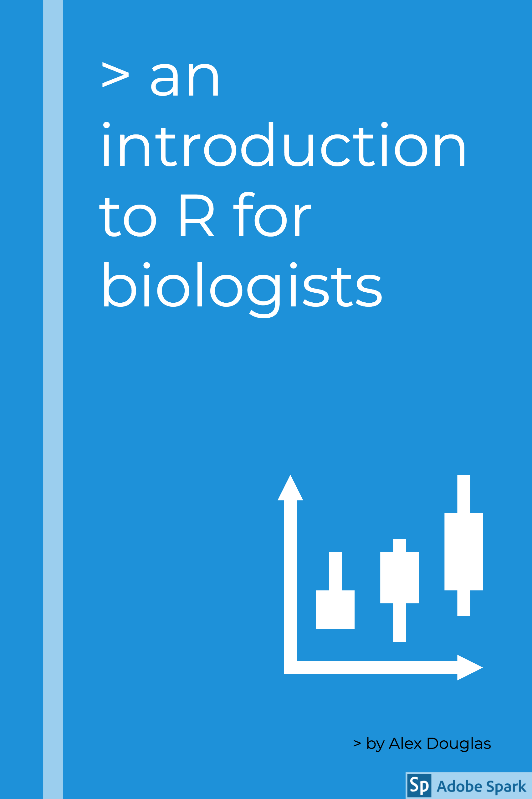

--- 
title: "A Introduction to R"
author: "Alex Douglas"
date: "`r gsub(' 0', ' ', format(Sys.Date(), '%B %d, %Y'))`"
site: bookdown::bookdown_site
output: bookdown::gitbook
documentclass: book
bibliography: [book.bib, packages.bib]
biblio-style: apalike
link-citations: yes
cover-image: images/rbook_cover2.png
github-repo: "alexd106/Rbook"
description: "An Introduction to R"
---

# Welcome{-}

The purpose of this guide is to introduce you to using R, a modern, interactive environment for statistical computing and research. R in itself is not difficult to learn, but just like any new language the initial learning curve can be a little steep and you will need to use it frequently otherwise it’s easy to forget. 

A few notes about the course and this guide. Although you can use this guide as a standalone resource, I recommend you use it in conjunction with the companion [course website](https://alexd106.github.io). The course website contains a series of exercises for you to practice your coding and test your understanding of key concepts. You will also find R code for the exercise solutions and a plethora of links to additional resources. I suggest you work through the exercises during the course and encourage you complete these in your own time - you certainly won’t learn how to use R by watching other people do it.

In this guide I have tried to simplify the content as much as possible and have based it on my own personal experience of teaching (and learning!) R over the last 15 years. It is not intended to cover everything there is to know about R - that would be an impossible task. Neither is it intended to be an introductory statistics course, although you will be using some simple statistics to highlight some of R’s capabilities. The main aim of this course is to help you climb the initial learning curve in a supportive and relaxed environment and provide you with the basic skills to enable you to further your experience in using R. There may be times when things get a little tough or frustrating (especially for those who have little or no experience of using the command line), however try to stick with it, the time and energy you invest now will be utterly transformative to your research. 

Finally, once you have finished this course, I encourage you to practice what you have learned on your own data. If you don’t have any data yet, then ask your supervisor or friends for some (I’m sure they will be delighted!) or follow one of the many excellent tutorials available online (see the course website for more details). My suggestion to you, is that while you are getting to grips with R, uninstall any other statistics software you have on your computer and only use R. This may seem a little extreme but will hopefully remove the temptation to ‘just do it quickly’ in a more familiar environment and consequently slow down your learning of R. Believe me, anything you can do in your existing statistics software package you can do in R (often better and more efficiently). 

Good luck and have don’t forget to have fun. 
