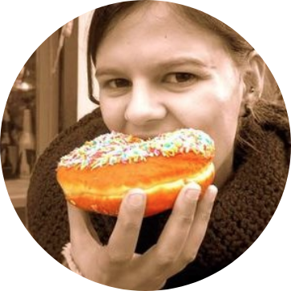

--- 
title: "An Introduction to R"
author: "Alex Douglas, Deon Roos, Francesca Mancini, Ana Couto & David Lusseau"
date: "Draft: `r gsub(' 0', ' ', format(Sys.Date(), '%B %d, %Y'))`"
site: bookdown::bookdown_site
output: bookdown::gitbook
always_allow_html: true
documentclass: book
#bibliography: [book.bib, packages.bib]
#biblio-style: apalike
link-citations: yes
colorlinks: yes
fontsize: 12pt
monofont: "Source Code Pro"
monofontoptions: "Scale=0.7"
github-repo: "alexd106/Rbook"
description: "An Introduction to R"
---

```{r setup, echo=FALSE}
source('common.R')
```

# Preface{-}

## The aim of this book

The purpose of this book is to introduce you to using R, a powerful and flexible interactive environment for statistical computing and research. R in itself is not difficult to learn, but as with learning any new language (spoken or computer) the initial learning curve can be a little steep and somewhat daunting. We have tried to simplify the content of this book as much as possible and have based it on our own personal experience of teaching (and learning) R over the last 15 years. It is not intended to cover everything there is to know about R - that would be an impossible task. Neither is it intended to be an introductory statistics course, although you will be using some simple statistics to highlight some of R’s capabilities. The main aim of this book is to help you climb the initial learning curve and provide you with the basic skills and experience (and confidence!) to enable you to further your experience in using R.

## Who is this book for?

We hope this book will be a useful introduction for anyone who wants to learn how to use R. It started out as a 100 page pdf manual used to support our teaching in numerous undergraduate and postgraduate biostatistics classes at the [University of Aberdeen][uoa] and has evolved over the last 10 years to the book you are now reading. Consequently, this book is primarily written with the advanced undergraduate or postgraduate student in mind although the material should be useful for anyone with an interest in learning R regardless of background. Our book assumes that you have no previous experience of using either R or RStudio and no background in programming or using command-line interface software. We have also tried to make the content of this book operating system agnostic and have included information for Windows, Mac and Linux users where appropriate. 

## Why an open book?

We decided to write this book as a freely available open source document for a number of reasons. Firstly, we hope this book will be a living document that naturally evolves over time. As such, if you find any errors in the book or want to make a suggestion on how to improve it, please open an issue on the GitHub [site][github-issue] or click on the edit button `r icon::fa_edit()` in the navigation bar at the top of this page and issue a pull request. If you want to take a peek at all the code behind the book visit the book GitHub [repo][github-repo]. If you feel like contributing to the book, please get in touch, we would be happy to hear from you. Secondly, the release of the [bookdown][bookdown] package by Yihui Xie has made it incredibly easy to collaboratively write, update and maintain this book using [RMarkdown][rmarkdown] and [RStudio][rstudio]. Without the bookdown package this book wouldn't exist in its current format. Lastly, R is not just software, it's also a wonderful open community with many thousands of contributors all working to make R even better. This is our small contribution.  

This book is completely free for you to use and is licensed according to the Creative Commons Attribution-NonCommercial 4.0 International (CC BY-NC 4.0) License.

## Who are we?

\  

```{r who-are-we, echo=FALSE, warning=FALSE, message=FALSE}
library(dplyr)
library(knitr)
library(kableExtra)

AD <- '**Alex Douglas** is a Reader in Biostatistics at the University of Aberdeen and has been teaching (and learning) R for the last 15 years.<br>- Web: https://www.abdn.ac.uk/people/a.douglas/<br>- Twitter: https://twitter.com/Scedacity<br>- GitHub: https://github.com/alexd106'

DR <- '**Deon Roos** is a PhD student in applied ecology at the University of Aberdeen researching spatial variation of the temporal kind in population dynamics. He has been using and teaching R for 5 years.<br>- Web: https://www.abdn.ac.uk/people/deon.roos<br>- Twitter: https://twitter.com/DeonRoos88<br>- GitHub: https://github.com/Deon88'

AC <- '**Ana Couto** is a PhD student in Ecology at the University of Aberdeen looking at the ecology and physics of tidal stream habitats. She has been using and teaching R for 7 years.<br>- Web: https://www.abdn.ac.uk/people/r01ac17<br>- Twitter: https://twitter.com/AnaSofiaCouto<br>- GitHub: https://github.com/Anofia'

FM <- '**Francesca Mancini** is an ecological modeller, working with large citizen science datasets and statistical models to derive trends in biodiversity change and investigate its drivers.<br>- Web: https://FrancescaMancini.github.io<br>- Twitter: https://twitter.com/frances_mancini<br>- GitHub: https://github.com/FrancescaMancini'

DL <- '**David Lusseau** is a Professor of Marine Sustainability at the Danish Technical University. He\'s been using R for 15 years and teaching it for 12 years.<br>- Twitter: https://twitter.com/lusseau<br>- GitHub: https://github.com/dlusseau'

df1 <- data.frame(col1 = c('', '', '', '', ''), col2 = c(AD, DR, AC, FM, DL))

knit_table <- function(df){
  if (is_html_output()) {
    df %>%
      kable("html", escape = F, col.names = NULL, linesep = "") %>%
      kable_styling()
  } else {
    df <- data.frame(lapply(df, function(x) {gsub("<br>", "\n", x)}), stringsAsFactors = F)

    df %>%  
      mutate_all(linebreak) %>%
      kable("latex", booktabs = T, escape = F, col.names = NULL, linesep = "")  
  }
}

knit_table(df1)

```

## Book website

Although you can use this book as a standalone resource, we recommend you use it in conjunction with the companion [website][course-web]. The course website contains a series of exercises which will help you practice writing R code and test your understanding of key concepts - you certainly won’t learn how to use R by watching other people do it (or reading a book about it!). The website also contains solutions for each of the exercises and a plethora of links to additional tutorials and resources. 

## Some R pointers

A question we get asked fairly regularly is *'what's the best/easiest way to learn R?'*. Unfortunately, we don't have a ready answer to this question as everyone tends to learn R in their own way and at their own pace. Having said that, here are a few things to bear in mind that might help:

- Use R often and use it regularly - find any excuse to fire up R (or RStudio) and get coding to help build and maintain all important momentum. 

- Learning R is not a memory test. One of the beauties of a scripting language is that you will always have your code to refer back to when you inevitably forget how to do something.

- You don't need to know everything there is to know about R to use it productively. If you get stuck, Google it, it's not cheating and writing a good search query is a skill in itself. Just make sure you check thoroughly that the code you find is doing what you want it to do.

- If you find yourself staring at code for hours trying to figure out why it's not working then walk away for a few minutes. We have lost count of the number of times we were able to spot our mistake almost immediately after returning from a short caffeine break.

- In R there are many ways to tackle a particular problem. If your code doesn't look like someone elses, but it does what you want it to do in a reasonable time and robustly then don't worry about it - job done. 

- Related to our previous point, remember R is just a tool to help you answer your interesting questions. Although it can be fun to immerse yourself in all things R, don't lose sight of what's important - your research question(s) and your data. No amount of skill using R will help if your data collection is fundamentally flawed or your question vague. 

- Recognise that there will be times when things will get a little tough or frustrating. Try to accept these periods as part of the natural process of learning how to use R (we've all been there) and remember, the time and energy you invest now will be more than payed back in the not too distant future.

Finally, once you've finished working your way through this book, we encourage you to practice what you've learned using your own data. If you don’t have any data yet, then ask your colleagues / friends / family for some (we're sure they will be delighted!) or follow one of the many excellent tutorials available on-line (see the course [website][course-web] for more details). Our suggestion to you, is that while you are getting to grips with R, uninstall any other statistics software you have on your computer and only use R. This may seem a little extreme but will hopefully remove the temptation to *‘just do it quickly’* in a more familiar environment and consequently slow down your learning of R. Believe us, anything you can do in your existing statistics software package you can do in R - often more robustly and efficiently. 

Good luck and have don’t forget to have fun. 

\  

The book is licensed according to the Creative Commons Attribution-NonCommercial 4.0 International (CC BY-NC 4.0) License. Please see the terms of that license for more details. To view a copy of this license, visit https://creativecommons.org/licenses/by-nc/4.0/ or send a letter to Creative Commons, 444 Castro Street, Suite 900, Mountain View, California, 94041, USA.

\  

\  

```{r links, child="links.md"}
```

